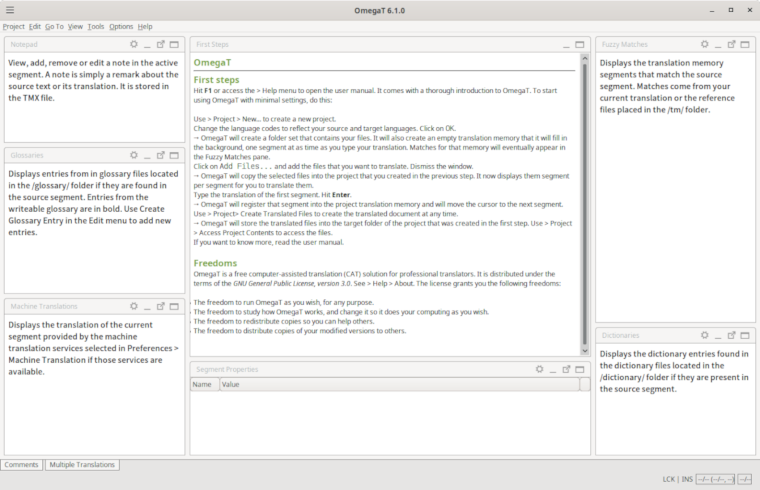
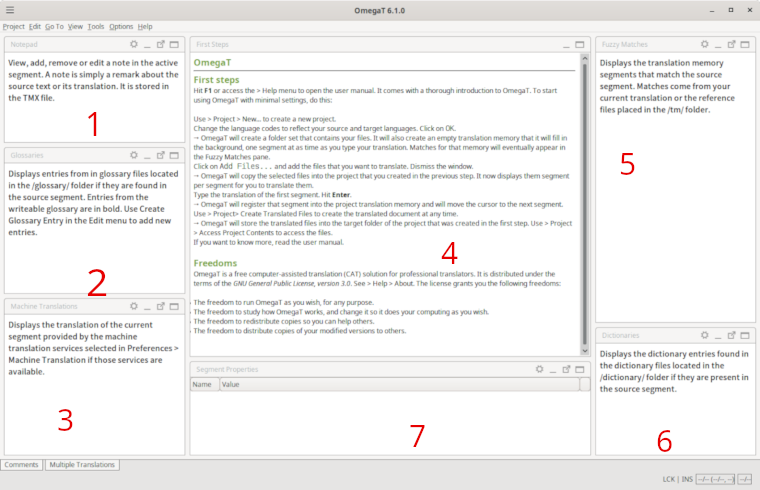
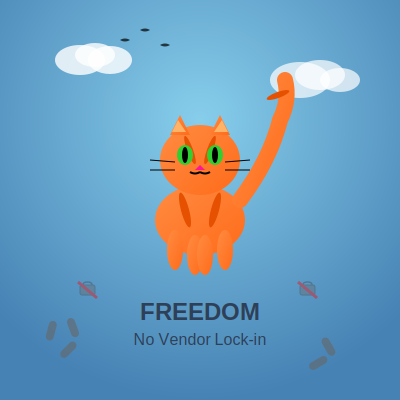

<!-- Title Slide -->
<!-- _class: gaia lead -->
<!-- _paginate: false -->
<!-- _header: '' -->
<!-- _footer: '' -->

# OmegaT
### Desktop Translation Platform for Professionals and FLOSS Contributors

**Hiroshi Miura**  
🇹🇼 L10N in FLOSS Projects

---

<!-- 講演者紹介 -->

**Who am I**
- Hiroshi Miura from Tokyo
- **FLOSS** contributor: Linux, Python etc.
- Lead **developer** of OmegaT
- President of **OSM Foundation Japan**
- LinkedIn(@miurahr)

---

<!-- Opening hook -->

## 🌍 Why L10N Matters

- Bring open‑source software -> Local users
- ❌ language barriers, 💕 fosters inclusive
- Supports digital sovereignty and community growth
- FLOSS thrives when translated by communities themselves

---

<!-- What is OmegaT -->

## 🚀 OmegaT: What & Why?

- Free/Open‑source Computer‑Assisted Translation (CAT) tool
- Developed by volunteers; cross‑platform Java application (Windows/macOS/Linux)
- Great starting point for professionals and newcomers alike
- High speed / high-quality translation for each translator

---

## 🛠 What Makes a CAT Tool Useful?

- Builds a **Translation Memory (TM)** for consistent reuse
- Supports **Glossaries** to standardize terminology
- Combines AI-powered MT, and community knowledge
- Segment(片段)‑based interface ensures **no text is missed**
- Keeps formatting across various document types

---

## ⏱ Instant‑Start

1. **Create a new project**: name, source and target languages
2. **Import source files** into `/source` folder
3. **Translate segment by segment**: Ctrl + U to move through segments, inline editing
4. **Validate tags** before export result: Ctrl + Shift + V
5. **Generate translated documents**: Ctrl + D → outputs in `/target` folder

---

## 🔎 Interface & Panes

--- 

## ✅ Feature Highlights

- Handles **fuzzy matches** from TMX Memory, AUTO‑propagates across segments
- Glossary lookup and **bi‑lingual dictionaries**
- Supports **multiple file types** such as ODT, DOCX, Markdown, PO-file, etc.
- Simple **keyboard-driven workflow**, efficient for power users
- Modular extension by bundled and 3rd party **Plugins** 

---

## 🔎 Interface and Panes

- **Main panes**: Editing (4), Fuzzy Matches(5), Glossary(2), Property(7)
- **Optional panes**: MT(3), Dictionary(6), Notes(1), Comments
- Tag walls are grayed out, non‑editable to prevent corruption

---

## 🤖 AI‑Augmented Workflow

- Plugins for major AI-MT engines: DeepL, Google, TexTra, etc.
- Apply AI suggestions *when needed*, without being locked in
- Use *memory* and *glossaries* first; then machine translation as a helper

---

## 🧩 How FLOSS Users Can Benefit

- Volunteers can translate documentation, manuals, and UI
- Supports sharing *memories* and *glossaries* across projects
- Interoperable with Web platforms such as Transifex, Crowdin, and wikimedia
- Team project easily hosted on GitHub repository
- Automated publish with GitHub Actions

---

## New Era: AI & Translation

- Generative AI services (e.g. ChatGPT, Gemini)
- Convenience, but vendor lock-in risk
- Privacy, licensing, and data concerns
- FLOSS needs **open** and **user-controlled** tools

---

## Next New features?

- Bundled spell checker dictionaries
- Support Windows 11/Linux on ARM64
- Support M1/M2 Mac
- Installer variants: DEB and RPM

---

## What's Coming in Future?

- 🧩 Plugin online installer
- ✅ Support for popular Gen-AI engines
- 🔍 AI-assisted Quality Assurance
- 🌍 Better support for FLOSS localization workflows

---

## 🤝 Join the OmegaT Community

- Web site: *omegat.org*
- GitHub repo: *omegat-org/omegat*
- Active user group and forum support
- Call for Contribution: code, plugins, translations, documentation

---

## 🏃‍♂️ Call to Action

- Download OmegaT (**free**) → [omegat.org](https://omegat.org)
- Try it out with a FLOSS project or documentation
- Join our community: contribute plugins, ideas
- Help build a multilingual open-source ecosystem!

---

## 🙏 Thank You!

**Questions & discussion welcome!**  
Let’s make FLOSS truly global together with OmegaT.  

_Hiroshi Miura_ - [omegat.org](https://omegat.org) - GitHub: *omegat-org/omegat*

<!-- Add this anywhere in your Markdown file -->

